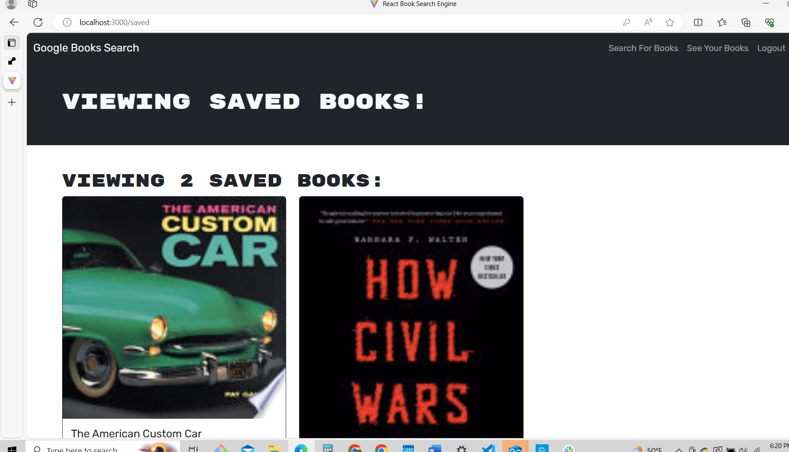

# 21 MERN: Book Search Engine

## Despcrition

Refactored Google Books search engine to be a GraphQL API built with Apollo Server.

The application was built using the MERN stack with a React interface, a MongoDB database, and a Node.js/Express.js server and API. end.

## screenshot

## Link 

[Link](https://book-search-engine-2zwd.onrender.com)